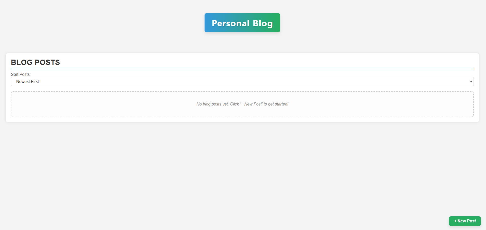
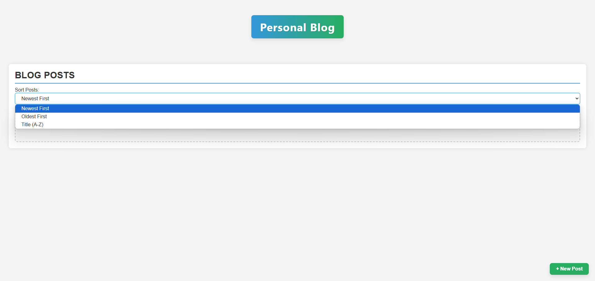
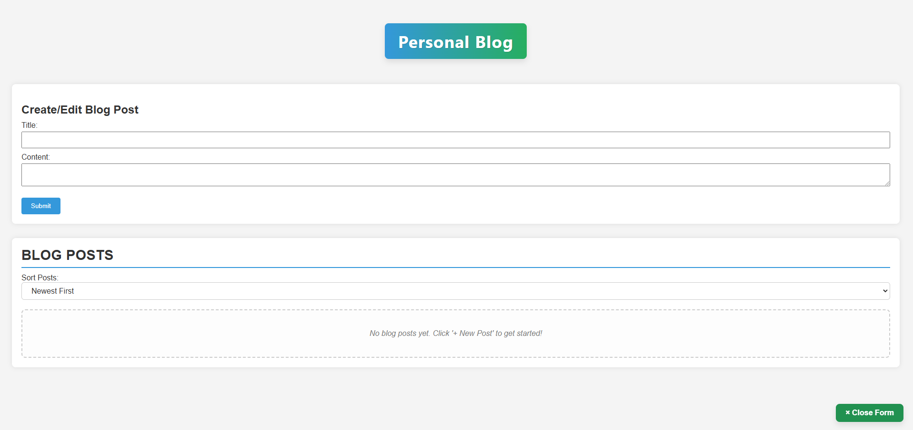

# Interactive Personal Blog Platform

- [Interactive Personal Blog Platform](#interactive-personal-blog-platform)
  - [Overview](#overview)
  - [Project Preview](#project-preview)
  - [Development](#development)

## Overview

For this project, I was tasked with building an **Interactive Personal Blog Platform** with the intended goals:

**Create New Posts**:

- A form with fields for a post title and post content (e.g., using `<input type="text">` for title and `<textarea>` for content).
- Upon submission, the new post should be added to a list of posts displayed on the page.
- The form should be validated: both title and content are required.
- Display custom, user-friendly error messages if validation fails.

**Display Posts**:

- All created posts should be displayed on the page. Each displayed post should clearly show its title and content.
- Posts should be rendered dynamically using JavaScript.

**Edit Posts**:

- Each displayed post should have an “Edit” button.
- Clicking “Edit” should allow the user to modify the title and content of that specific post. This might involve populating the main form (or a modal form) with the existing post data.
- After editing, the updated post should be reflected in the display.
- Form validation should also apply during editing.

**Delete Posts**:

- Each displayed post should have a “Delete” button.
- Clicking “Delete” should remove the post from the display and from localStorage.

**Data Persistence with `localStorage`**:

- All blog posts (title, content, and perhaps a unique ID and timestamp you generate) must be saved in `localStorage`.
- When the page is loaded or refreshed, any posts previously saved in `localStorage` should be retrieved and displayed.
- Updates (from edits) and deletions must also be reflected in `localStorage`.

In order to create a dynamic and interactive blog, I applied a wide range of concepts, including **DOM manipulation**, **event handling**, **JavaScript form validation**, and **utilizing local storage for data persistence**.

[Click Here to Access Interactive Personal Blog Platform](https://htmlpreview.github.io/?https://github.com/jcwynder/interactive-personal-blog-platform/blob/main/index.html)

## Project Preview

Visual Displays of Project:

- Initial rendering of blog platform with no saved user data
  

- Rendering to display selection option in dropdown menu
  

- Rendering to showcase create/edit form population after "+ New Post" button is clicked
  

- Rendering to showcase a display of blogs posted. Within the posts' rendering includes the posts' title and content fields, posting date, last edit posting, action buttons to edit the posts' field data or to delete the post, and filtering by one of the selected dropdown options ("Oldest First").
  

## Development

The development for this project began with me establishing the type of design I wanted to implement for the blog platform's layout. Basec on the final presentation for this platform, I would describe the overall design as **modern**, **clean**, and **user-friendly**.

Below is a list of key design elements and features applied:

1. Header Design

- **Blog Title**: Blog's title is prominently displayed at the top center of the page in a **gradient background** (blue to green). It uses a **bold font** with a slight **text shadow** and **rounded corners** for a professional look.

- **Responsive**: The header and blog title are centered, making the design simple and clean, while adapting well to different screen sizes.

2. Content Layout

- **Two Main Sections**:

  - **Post Section**: Displays all blog posts, dynamically rendered using JavaScript. Each post appears as a card, styled with a **border** and **rounded corners**, with subtle hover effects (elevating and shadow effects) to make it feel interactive and engaging.

  - **Form Section (New Post Form)**: This area is hidden or collapsed by default but can be revealed by clicking the "**New Post**" button. Form is clean, with minimal distractions, allowing users to enter a **title** and **content** for their blog post.

- **Post Cards**:

  - Each blog post has a **title**, **content**, and **timestamps** (created and edited), allowing for easy readability and organization.

  - **Buttons**: Each post includes **Edit** and **Delete buttons**, which are neatly aligned in a row for better control. These buttons have a matching blue color to align with the overall theme.

3. Post Interaction

- **Edit and Delete Buttons**: These buttons provide interactivity for users, allowing them to modify or delete posts. The use of **event delegation** ensures that any new posts or dynamic elements that are added will still be functional.

- **Form Validation**: The title and content fields are validated to prevent empty submissions, providing a clear error message if the fields are left blank.

4. Form Toggle & Collapse

- The "**New Post**" form is **collapsible** using a **toggle button**. When clicked, it **slides in or out**, depending on the user's actions.

- The **collapsed state** is handled using a simple CSS transition with a smooth easing effect.

- Implemented **auto-collapse** and **confirm discard changes** functionality, ensuring the user can discard or keep changes made to the form before closing it.

5. Floating Action Button (Overlay Button)

- The **floating button** ("**New Post**" button) is intended to be **fixed** in a position (bottom-right corner by default). This provides easy access to the form while users can continue scrolling through the page.

6. Post Sorting

- Added a sort dropdown to the page, giving users control over how they view the posts: by **newest**, **oldest**, or **alphabetically by title**.

- The selected sorting preference is saved to `localStorage`, ensuring that the user's settings persist across sessions.

7. Responsive Design Considerations

- The layout is styled using relative units, like `em` and `%`, making it responsive across different screen sizes.

- The form elements are designed to take the full width of their container, ensuring a clean and easy-to-use input experience.

8. Error Handling

- The form displays **error messages** (red text) next to the title and content fields if validation fails, providing clear guidance to the user.

9. Empty State Message

- If no posts exist, a helpful "**No blog posts yet**" message is shown, prompting the user to add a new post. This improves the user experience when the page has no content.

10. Smooth Transitions and Hover Effects

- Posts have subtle animations like **hover effects** that lift the post card slightly and give a shadow, providing a more interactive, modern feel.

- The **form transition** (for collapsing and expanding the form) makes the experience smooth and aesthetically pleasing, giving the user a sense of control over the interface.
